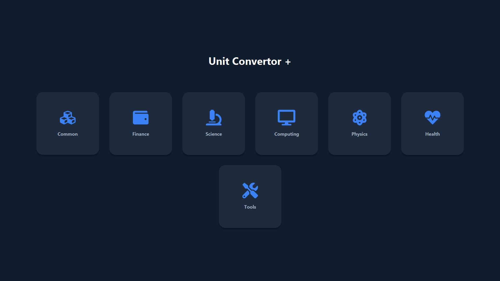
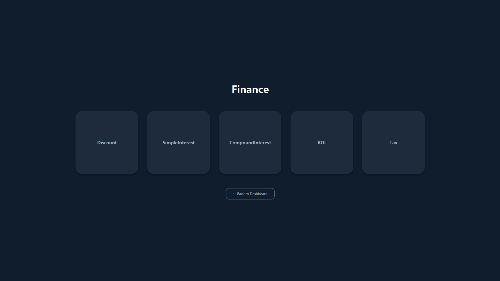
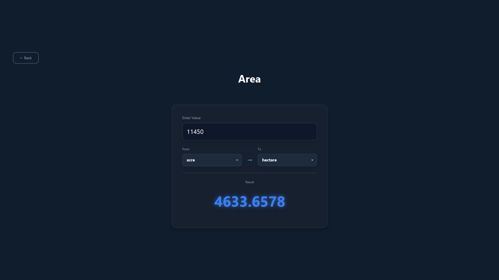

# Unit Converter Hub

A modern cross-platform desktop unit converter application built with **JavaFX**, **Maven**, and **Gson**.
The project uses a fully dynamic JSON-driven conversion system with a clean UI, reusable converter architecture, and modular service-based design.

---

## Table of Contents

* [Features](#features)
* [Concept & Working](#concept--working)
* [Technologies Used](#technologies-used)
* [Setup & Running](#setup--running)
* [Packaging as Desktop App](#packaging-as-desktop-app)
* [Folder Structure](#folder-structure)
* [Picture](#picture)

---

## Features

1. **Category Dashboard**

   * Displays conversion categories in a modern card-based layout.
   * Dynamic category generation from JSON data.

2. **Dynamic Conversion System**

   * Units and conversion rules are loaded from `units.json`.
   * Easily expandable without modifying application logic.

3. **Real-Time Conversion**

   * Converts values instantly while typing.
   * Handles decimal precision automatically.

4. **Modular Conversion Engine**

   * Separate engines for:

     * Conversion processing
     * Formula evaluation
     * Algorithm handling
     * Input parsing

5. **Modern JavaFX UI**

   * Responsive layouts using FXML and CSS.
   * Smooth animations and reusable components.

6. **FontAwesome Icons**

   * Integrated icon support using Ikonli.

7. **Clean Architecture**

   * Proper separation between:

     * Models
     * Services
     * Controllers
     * Core logic
     * Utilities
     * UI layouts

---

## Concept & Working

### 1. Main Application (`Main.java`)

* Launches the JavaFX application.
* Loads the dashboard scene and global stylesheet.

### 2. Launcher (`MainLauncher.java`)

* Used for packaged JAR execution to avoid JavaFX launcher issues.

### 3. Data Loading (`FileLoader.java`)

* Reads `units.json`.
* Parses conversion data using Gson.
* Builds runtime category and unit models.

### 4. Core Engine Layer

Handles the main conversion logic:

* `ConversionEngine.java`
* `FormulaEngine.java`
* `AlgorithmEngine.java`

Responsible for:

* Formula-based conversions
* Algorithm-based calculations
* Dynamic conversion processing

### 5. Services Layer

Provides reusable business logic:

* `ConversionService.java`
* `FormulaService.java`
* `AlgorithmService.java`
* `InputParserService.java`

### 6. UI Controllers

Controls all JavaFX screens:

* `DashboardController.java`
* `CategoryController.java`
* `ConvertorController.java`

Responsible for:

* Dynamic UI rendering
* User interaction handling
* Updating conversion results

---

## Technologies Used

* **Java 21** - Core programming language
* **JavaFX 21** - Desktop UI framework
* **Maven** - Dependency management and build tool
* **Google Gson** - JSON parsing
* **Ikonli FontAwesome** - JavaFX icon support

---

## Setup & Running

### 1. Clone the repository

```bash id="l6v2zc"
git clone <repo-url>
cd convertor
```

### 2. Run using Maven

Make sure Java 21 and Maven are installed.

```bash id="dl74jy"
mvn clean javafx:run
```

---

## Packaging as Desktop App

### 1. Build executable JAR

```bash id="9u3s6q"
mvn clean package
```

Generated file:

```bash id="4ybj2u"
target/convertor-1.0-SNAPSHOT.jar
```

---

### 2. Create Windows App

```powershell id="h3q0eu"
mkdir deploy
cp target/convertor-1.0-SNAPSHOT.jar deploy/

jpackage --type app-image --name "UnitConverterHub" --input deploy --main-jar convertor-1.0-SNAPSHOT.jar --main-class com.hub.MainLauncher --dest output
```

Executable location:

```bash id="s5r5nn"
output/UnitConverterHub/UnitConverterHub.exe
```

---

## Folder Structure

```text id="7qg04f"
convertor/
├─ .vscode/
│
├─ src/
│  └─ main/
│     ├─ java/com/hub/
│     │
│     │  ├─ core/
│     │  │  ├─ AlgorithmEngine.java
│     │  │  ├─ ConversionEngine.java
│     │  │  └─ FormulaEngine.java
│     │  │
│     │  ├─ models/
│     │  │  ├─ Category.java
│     │  │  ├─ ConversionResult.java
│     │  │  ├─ RootData.java
│     │  │  └─ Unit.java
│     │  │
│     │  ├─ services/
│     │  │  ├─ AlgorithmService.java
│     │  │  ├─ ConversionService.java
│     │  │  ├─ FormulaService.java
│     │  │  ├─ InputParserService.java
│     │  │  └─ ParsedInput.java
│     │  │
│     │  ├─ ui/
│     │  │  ├─ controllers/
│     │  │  │  ├─ CategoryController.java
│     │  │  │  ├─ ConvertorController.java
│     │  │  │  └─ DashboardController.java
│     │  │  │
│     │  │  └─ utils/
│     │  │     └─ FXAnimation.java
│     │  │
│     │  ├─ utils/
│     │  │  └─ FileLoader.java
│     │  │
│     │  ├─ Main.java
│     │  └─ MainLauncher.java
│     │
│     └─ resources/
│        ├─ css/
│        │  └─ style.css
│        │
│        ├─ fxml/
│        │  ├─ category.fxml
│        │  ├─ convertor.fxml
│        │  └─ dashboard.fxml
│        │
│        ├─ images/
│        └─ units.json
│
├─ target/
├─ dependency-reduced-pom.xml
└─ pom.xml
```

---

## Picture

### Dashboard


### Category Screen


### Conversion Screen


---
